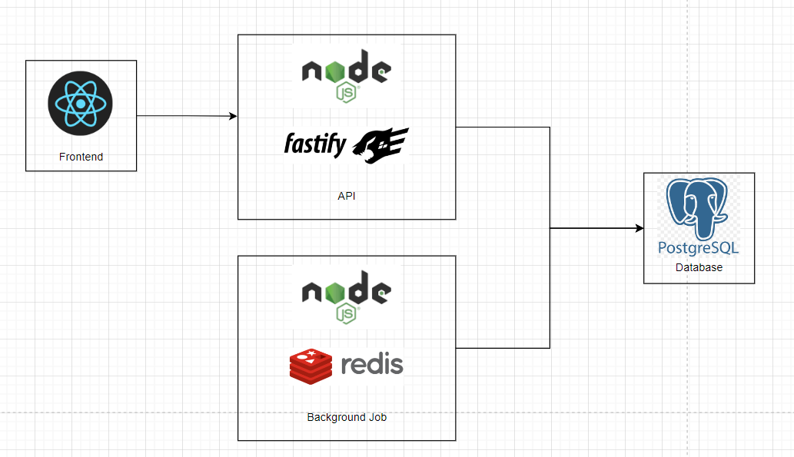
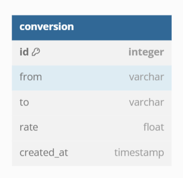

## Table of content

- [Technical Design](#technical-design)
- [Running Locally](#running-locally)

## Technical Design

### System Design

To fulfill the challenge's demands, two applications were: a backend responsible for providing an API to expose currency conversion rates and implementing a background job for periodically persist currency conversion data, and a frontend designed to enhance the user experience.

The high level design is like below:



The motivation behind this design is to ensure a scalable and consistent service. With the background job running periodically we can persist all conversion rates, and keep a history of them. Also creating an "in-house" API keeps things decoupled, for example, if we want to change the external provider or even maintain two providers for conversions, we can do that without affecting the frontend.

#### Currency Service (Backend)

The currency service was developed using NodeJS+Typescript with the Fastify framework for the API. Fastify is a modern and efficient framework that provides a scalable approach to our service. For the background job, BullMQ was used with Redis as a broker. For data persistence, PostgreSQL was chosen, a widely used and scalable database.

The service is structured following the hexagonal architecture, dividing the code into distinct layers:

- Domain: The core of the application. It holds all the business logic.
- Application: Is everything that your application does. It orchestrates business operations.
- Infrastructure: External dependencies that the application needs to work. For example, the database.
- Presentation: Is the UI layer of the application. In our case, the API and also the background jobs.

Adopting hexagonal architecture provides several benefits to our application. First, it ensures that our service remains reliable and highly maintainable. By separating business logic from external dependencies, we can easily make changes and updates without affecting other parts of the system.

#### Currency App (Frontend)

The Currency App was built with React framework. It performs a request to our backend at every 5 minutes, that way we can always be updated when a new conversion rate arrive.

### Data Design

Below is the data design implemented for the database:



### Reliability Design

- Retries with exponential backoff were created for our background job. That way we can be more resilient in case of the external API fails
- Retries were created in the frontend when requesting our API.

### Testing Design

Both unit and integration tests were created for the applications. This approach ensures the maintainability and high quality of the software.
Also to ensure the quality of the services, a CI pipeline was created to check code format and run tests.

## Running Locally

#### Requirements

- [Docker](https://www.docker.com/)

#### Run Application

Before running the application you need to create a API KEY for the [Currency Converter API](https://rapidapi.com/natkapral/api/currency-converter5). Follow the steps for creating your key and after that paste your key at [docker-compose.yml](./docker-compose.yml) file, look for the `CURRENCY_API_KEY` variable.

After creating the key you can follow the below steps to run the application.

1. Build the images

   ```sh
   docker compose build
   ```

2. Migrate the database

   ```sh
   docker compose run currency_svc npm run migrate
   ```

3. Start Applications

   ```sh
   docker compose up
   ```

   - add `-d` flag if you'd rather run it in background

4. Access the frontend application at http://localhost:3000 and the backend at http://localhost:8000

#### Background Job

The background job is configured to run every hour, if you want to quickly test the background job you can change the cron configuration as you wish, for example, every minute (\* \* \* \* \*). To do that, look for the `JOB_REPEAT_PATTERN` variable at [docker-compose.yml](./docker-compose.yml) file and change it.

#### Run Tests

Backend tests:

```sh
docker compose run currency_svc npm run test
```

Frontend tests:

```sh
docker compose run currency_app npm run test
```
